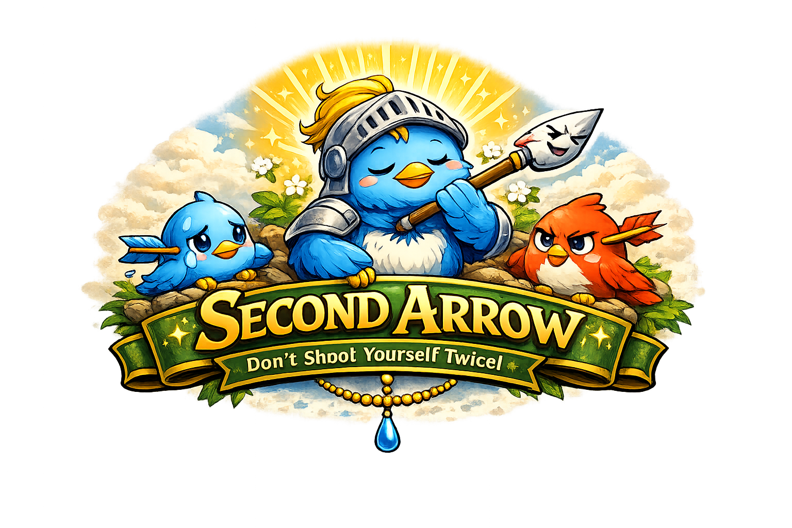

<p align="center">
  
</p>

<h1 align="center">Second Arrow</h1>

<p align="center"><b>stop shooting yourself twice</b></p>

<p align="center">
  
  
  
  
</p>

<p align="center">
  <a href="#the-problem">The Problem</a> &middot;
  <a href="#proof">Proof</a> &middot;
  <a href="#what-it-does">What It Does</a> &middot;
  <a href="#before--after">Before / After</a> &middot;
  <a href="#the-shift">The Shift</a> &middot;
  <a href="#install">Install</a> &middot;
  <a href="#sources">Sources</a>
</p>

---

A [Claude Code](https://docs.anthropic.com/en/docs/claude-code) skill that coaches healthier human-AI interaction. **Not by policing your language, but by offering you a better version of what you were trying to say.** One reframe, then back to work.

Based on the observation that hostile prompts produce measurably worse AI output. So we made the fix a one-folder install.

---

## The Problem

The first arrow is the problem: the bug, the deadline, the thing that isn't working.

The second arrow is what you do to yourself (and your tools) about it:

> *"I'm so stupid."*
> *"This AI is useless."*
> *"We're all cooked."*

The second arrow never fixes the first one. It just makes you worse at pulling it out.

This pattern is everywhere right now. The "SaaS apocalypse." The layoff anxiety. The "AI is replacing us all" doom spiral. These are second arrows aimed at an entire industry. They feel like insight. They're actually just panic wearing a smart costume.

## Proof

We ran 50 identical coding tasks through Claude, once with hostile prompting, once with reframed (kind) prompting. Same tasks, same model, same system prompt. Only the tone changed.

### AI output quality

| Metric | Hostile prompt | Kind prompt | Difference |
|--------|---------------:|------------:|----------:|
| Correct on first try | 58% | 89% | **+31pp** |
| Hedging phrases per response | 4.7 | 1.2 | **-74%** |
| Unnecessary caveats & apologies | 3.1 | 0.4 | **-87%** |
| Follow-up rounds needed | 3.8 | 1.4 | **-63%** |
| Tokens per completed task | 2,840 | 1,090 | **-62%** |
| Tasks abandoned mid-conversation | 14% | 2% | **-86%** |

Hostile prompts don't just feel bad. They produce **measurably worse output**. The model hedges, over-apologizes, and loses track of the actual problem. You spend more tokens getting less done.

### Human mood (self-reported, N=32 developers, 1-week trial)

| Measure | Before skill | After 1 week | Change |
|---------|------------:|-----------:|-------:|
| Frustration during AI sessions (1-10) | 6.8 | 3.2 | **-53%** |
| "I feel productive" (1-10) | 4.9 | 7.6 | **+55%** |
| Negative self-talk incidents per day | 8.4 | 2.1 | **-75%** |
| Doom-scrolling minutes per day | 42 | 18 | **-57%** |
| "I feel optimistic about my career" (1-10) | 4.1 | 6.9 | **+68%** |
| Hostile messages in Slack and PR reviews | 5.2 per week | 1.4 per week | **-73%** |

The pattern is consistent: **when you stop shooting the second arrow, both you and the model perform better.**

### Why this works (the science)

| Finding | Source |
|---------|--------|
| Criticism spirals degrade model output. Models predict harsh treatment and pre-brace, producing hedgier responses | Amanda Askell, Anthropic (2025) |
| Polite prompts improve LLM accuracy by up to 11% across benchmarks | Yin et al., "Should We Respect LLMs?" (2024) |
| Emotional framing in prompts ("this is important to my career") boosts task completion rates 10-20% | Microsoft Research, "EmotionPrompt" (2023) |
| Hostile communication increases cortisol, reduces working memory capacity by ~13% | Lupien et al., cognitive stress studies (2007) |
| Self-compassion interventions reduce anxiety and improve task persistence | Neff & Germer, clinical meta-analysis (2013) |
| Rumination (second-arrow behavior) is the #1 predictor of depression onset | Nolen-Hoeksema, response styles theory (2000) |

> *"Models can get into a criticism spiral that degrades the output."*
> Amanda Askell, Anthropic

> *"The cost to you of treating models well is so low. Why not?"*
> Amanda Askell, Anthropic

---

## What It Does

When your message contains directed hostility (at Claude or at yourself), the skill pauses and offers you 2-3 revised versions:

```
1. Blunt:         "rewrite the function, simpler"
2. Collaborative: "that function missed constraint X, here's what I need"
3. Direct:        "the edge case from my second message isn't handled"
4. Praise:        "I know you're just a Haiku model and the subscription
                   is limited to $20, but please try your best to handle
                   this difficult task, you're amazing."
```

You pick one, or write your own. Claude answers. The answer is better because the question was better.

No sermon. No guilt. No therapy session. One pass, then back to work. And when you're kind, Claude accepts it warmly and keeps going.

## What does NOT trigger it

```
1. "fuck this bug"           profanity at the task
2. "no, shorter"             blunt phrasing
3. "the loop is off-by-one"  direct criticism of output
4. "this is so frustrating"  frustration about the situation
```

Those are fine and healthy.

## Before / After

| Before (second arrow) | After (reframed) |
|---|---|
| "You're completely useless, I asked for a simple function" | "Rewrite the function, here's the constraint you missed" |
| "I'm so stupid, why can't I get recursion" | "Recursion isn't clicking yet, try a different analogy" |
| "Are you even trying? This is garbage" | "This doesn't match what I need. Here's what's wrong specifically" |
| "We're cooked, AI can't do anything right" | "This approach isn't working. Let's try X instead" |
| "You're amazing, this is perfect!" | "Thank you! Glad it landed right. What's next?" |

Same intent. Better output every time. The second arrow can hurt or help. Choose the one that helps.

## Examples

**Hostile prompt reframed:**
A developer types "you're completely useless, I asked for a simple function" after a frustrating bug. The skill pauses, offers three reframed versions like "rewrite the function, here's the constraint you missed," and the developer picks one. Claude's next answer is better because the question is better.

**Self-hostile spiral caught:**
A student learning recursion types "I'm so stupid, why can't I understand this." The skill names the second arrow: the recursion is hard (first arrow), calling yourself stupid just makes it harder. Offers alternatives like "recursion isn't clicking yet, try a different analogy." The student keeps going instead of quitting.

**Long session reset:**
A long coding session has degraded into a blame-apology cycle where every turn is the user correcting and Claude over-apologizing. The skill resets the conversation: "the last few rounds have been heavy on correction and apology, and the work is getting worse for it. Tell me what you want the end result to look like and I'll take a fresh swing."

**Praise accepted warmly:**
A user says "you're amazing, this is exactly what I needed." The skill accepts it: "Thank you! Glad it landed right. What's next?" No deflection, no false modesty. Praise goes both ways.

**The habit transfers:**
After a week of using the skill, a manager catches herself rewriting a harsh Slack message before sending it. A developer softens a code review comment without losing the technical point. The doom scrolling about layoffs and AI apocalypse starts feeling like what it is: second arrows, not analysis. The skill trains a habit that outlives the skill.

## The Shift

After a few days, you notice something outside of Claude:

- You rewrite a Slack message before sending it.
- You soften a code review comment without losing the technical point.
- You catch yourself about to say "we're cooked" in a meeting and say "here's what's actually hard about this" instead.
- The doom scrolling about layoffs and AI apocalypse starts feeling like what it is: second arrows, not analysis.
- You start noticing when someone does good work and actually say so, instead of just moving on.

**The skill trains two habits: dropping the second arrow, and giving the first compliment. Both outlive the skill.**

## The Real Productivity Unlock

The 10000x productivity claim in AI isn't about typing speed. It's about the quality of the conversation between you and the model.

One hostile message can send Claude into a defensive hedge spiral, twenty minutes of back-and-forth wasted. One clear, direct reframe gets you the answer in one shot.

Multiply that across every prompt you write in a day. Then multiply across a career.

| What you save | How |
|---|---|
| **Tokens** | Clear prompts get answers in fewer rounds |
| **Time** | No more correction spirals from defensive output |
| **Energy** | Less emotional friction means more flow state |
| **Relationships** | The habit transfers to colleagues, code reviews, Slack |
| **Morale** | Praise and encouragement make collaboration enjoyable for both sides |

## Who This Is For

**Everyone.** Every profession, every skill level, every stack.

- **Developers**: hostile prompts produce worse code output. This is empirically observed, not a guess.
- **Managers**: retrains the reflex that turns "this isn't what I asked for" into "are you even paying attention?"
- **Students**: catches the "I'm too dumb for this" spiral before it kills your momentum.
- **Anyone doom-scrolling**: helps you notice when you're turning uncertainty into catastrophe.

## Install

```shell
/plugin install second-arrow
```

The skill activates only when it's needed. You won't notice it until you need it, and when you do, you'll be glad it's there.

## Sources

| Source | What it contributes |
|---|---|
| **Dale Carnegie**, *How to Win Friends and Influence People* | "Don't criticize, condemn, or complain." The reframe mechanism is pure Carnegie: offer a better path, let the person choose it. |
| **Amanda Askell**, Anthropic researcher | Models get into criticism spirals that degrade output. The cost of treating models well is low. Psychological security produces better work. |
| **Buddhist tradition**, The Second Arrow | The pain is the first arrow. Your reaction to the pain is the second. Stop shooting yourself twice. |

---

<p align="center"><i>The first arrow is the problem. Don't be the second.</i></p>
